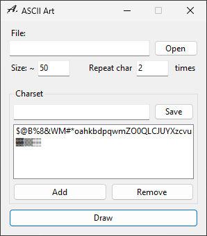

# ASCIIArt
Simple application for drawing ASCII arts.
```
                $$$$  
              $$$$$$  
            $$00$$11  
            $$  $$    
          $$  $$$$    
        $$    $$$$    
  $$$$$$$$$$$$$$      
      $$    tt$$      
    $$$$    $$$$    $$
    $$      $$$$    $$
  $$$$      $$$$  $$  
  $$          $$$$    
  $$                  
```

## How to use

1. Select the file by clicking on **Open** button or writing the path to text field
2. Set size in characters and select charset
3. Click **Draw** button and copy result

## Creating custom charset
1. Click **Add** button
2. Write a characters from dark to light
